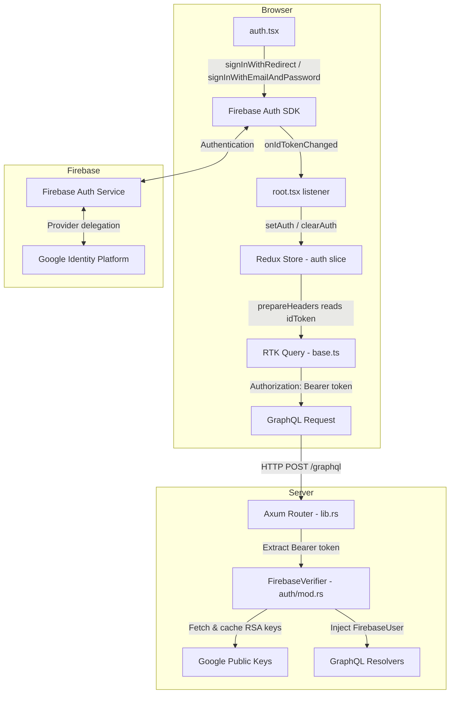
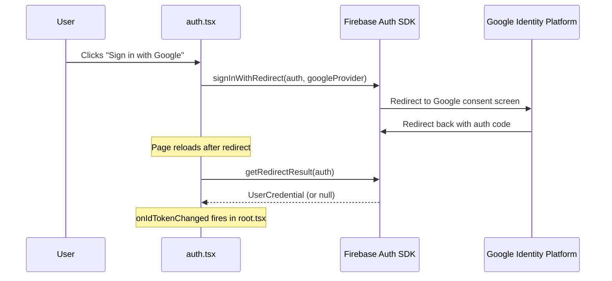
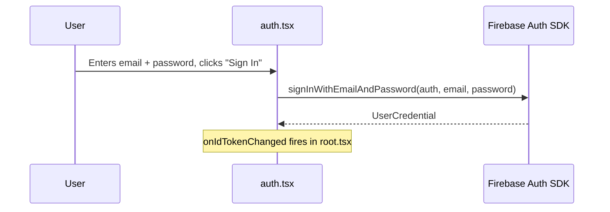
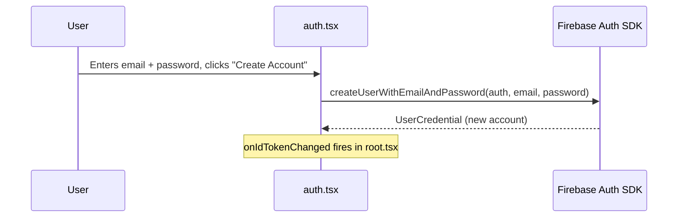
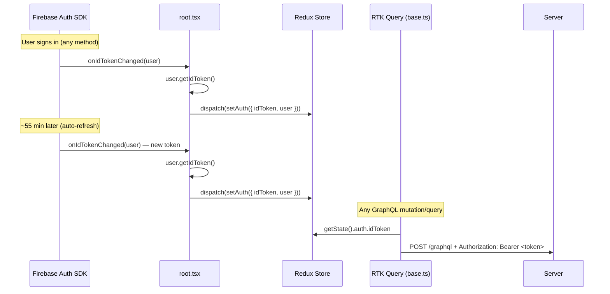
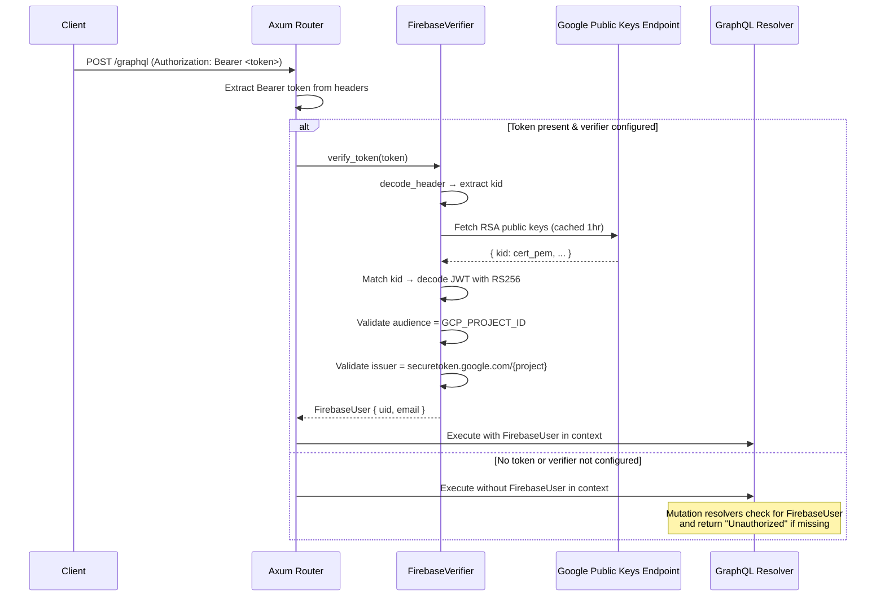

# Authentication Flow

This document describes how authentication works across the El Guacal web application, from user sign-in through to authenticated GraphQL requests.

## Overview

The app uses **Firebase Authentication** on the frontend and **local JWT verification** on the backend. There is no session cookie or server-side session — the Firebase ID token (a standard JWT) is the sole credential, stored in the browser by Firebase and attached to every API request.

## Architecture

## Sign-In Flow

### Google Sign-In (Redirect)

### Email/Password Sign-In

### Email/Password Sign-Up

## Token Lifecycle

Key details:

- Firebase ID tokens expire after **1 hour**
- Firebase SDK **auto-refreshes** tokens ~5 minutes before expiry
- `onIdTokenChanged` fires on every refresh, keeping the Redux store current
- Firebase persists sessions in **IndexedDB**, surviving page refreshes and browser restarts

## Server-Side Verification

The server **never calls Firebase** to verify tokens. Instead, it:

1. Decodes the JWT header to get the `kid` (key ID)
2. Fetches Google's public RSA keys from `googleapis.com/robot/v1/metadata/x509/securetoken@system.gserviceaccount.com` (cached for 1 hour)
3. Validates the JWT signature, audience (`GCP_PROJECT_ID`), issuer, and expiry locally

## Key Files

| File | Role |
|------|------|
| `apps/web/app/routes/auth.tsx` | Sign-in UI (Google + Email/Password) |
| `apps/web/app/utils/firebase.ts` | Firebase SDK initialization |
| `apps/web/app/root.tsx` | `onIdTokenChanged` listener → Redux sync |
| `apps/web/app/store/features/auth/slice.ts` | Redux auth state (`idToken`, `user`, `isAuthenticated`) |
| `apps/web/app/store/features/guacal-api/base.ts` | RTK Query base — attaches `Authorization` header |
| `apps/server/src/lib.rs` | Axum router — extracts Bearer token, calls verifier |
| `apps/server/src/auth/mod.rs` | `FirebaseVerifier` — local JWT validation with Google public keys |
| `apps/server/src/config.rs` | Reads `GCP_PROJECT_ID` env var (required for auth) |

## Environment Variables

### Frontend (build-time)

| Variable | Purpose |
|----------|---------|
| `VITE_FIREBASE_API_KEY` | Firebase web API key |
| `VITE_FIREBASE_AUTH_DOMAIN` | Firebase auth domain (e.g., `project.firebaseapp.com`) |
| `VITE_FIREBASE_PROJECT_ID` | Firebase project ID |
| `VITE_FIREBASE_STORAGE_BUCKET` | Firebase storage bucket |
| `VITE_FIREBASE_MESSAGING_SENDER_ID` | Firebase messaging sender ID |
| `VITE_FIREBASE_APP_ID` | Firebase app ID |

### Server (runtime)

| Variable | Purpose |
|----------|---------|
| `GCP_PROJECT_ID` | Used as JWT audience for token verification. If missing, `FirebaseVerifier` is `None` and all mutations return "Unauthorized" |
