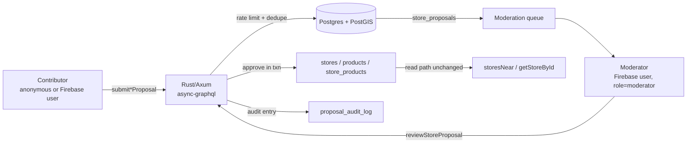

# Contribution & Moderation Flow

Status: Draft
Author: Pedro (with Claude as design partner)
Date: 2026-04-11
Scale target: ~100k MAU, ~100k stores, ~1k submissions/day peak

## 1. Problem

The README states that "anyone can go on the repository and add, edit, or remove locations". Today, `createStore`, `updateStore` and `deleteStore` (see `apps/server/src/api/commands/store.rs`) write directly to the canonical `stores` table after a minimal "is there a `FirebaseUser` in context?" check. There is:

- no author tracking on `stores`
- no moderation queue
- no rate limiting
- no optimistic concurrency on `stores` (two edits race, last write wins)
- no soft delete — `DELETE FROM stores` is irreversible
- no `users` table in Postgres; Firebase uid lives only in memory during a request
- no duplicate detection, so two contributors can both add "Tesco Streatham" 10m apart

At the scale we are designing for (100k MAU, 100k stores, ~1k submissions/day peak), the first scraper, prankster, or angry competitor that finds the form will poison the dataset. This document designs a moderation pipeline that keeps the read path untouched and inserts a human review step between contribution and canonical state.

## 2. Goals and non-goals

### Goals

- Anyone can propose a new store. Authenticated users can also propose edits and deletions.
- Every proposal carries enough provenance to audit, rollback, and measure trust.
- Moderators review a queue and approve or reject with a note.
- Approvals apply changes atomically to canonical tables. Rejections leave canonical state untouched.
- Read path (`storesNear`, `getStoreById`) is unchanged. No cache invalidation rewrite.
- 95% of proposals reviewed within 72 hours at steady state.
- Obvious anti-abuse: rate limits, captcha on anonymous submissions, duplicate detection on submit.
- Boring infra. Everything runs in the existing Rust/Axum + Postgres/PostGIS + Firebase Auth stack. No Kafka, no Redis unless we have to.

### Non-goals

- Bulk imports from external datasets. Out of scope; reserved for an `admin`-only mutation that bypasses the queue but writes to the audit log.
- Machine learning classification of submissions. Hooks are left open; no model ships in v1.
- Product taxonomy improvements. Tracked separately.
- Replacing Firebase Auth. ADR 0009 stands.
- Frontend framework rewrite. ADR 0007 stands — moderation UI lives inside the existing React Router v7 app at `/mod/*` until it outgrows it.

## 3. High-level architecture



The write path is split in two. `submit*Proposal` mutations write to `store_proposals`. `reviewStoreProposal` is the only code path that touches canonical tables from now on. The old `createStore` / `updateStore` / `deleteStore` mutations are kept and marked `@deprecated`, callable only by users with `role = 'admin'` for bulk imports and emergency overrides.

## 4. Data model

All changes ship in a single new migration. Additive only; existing `stores` rows keep working.

```sql
-- 4.1 Users — mirror of Firebase uid with app-level role and trust

CREATE TABLE users (
  user_id        uuid PRIMARY KEY DEFAULT uuid_generate_v4(),
  firebase_uid   text UNIQUE NOT NULL,
  email          text,
  display_name   text,
  role           text NOT NULL DEFAULT 'contributor'
                 CHECK (role IN ('contributor','moderator','admin')),
  region         text, -- ISO 3166-1 alpha-2; NULL for global moderators
  trust_score    integer NOT NULL DEFAULT 0,
  email_verified boolean NOT NULL DEFAULT false,
  created_at     timestamptz NOT NULL DEFAULT now(),
  updated_at     timestamptz NOT NULL DEFAULT now()
);

CREATE TRIGGER set_updated_at_users BEFORE UPDATE ON users
  FOR EACH ROW EXECUTE PROCEDURE set_updated_at();

-- 4.2 Optimistic concurrency on stores

ALTER TABLE stores ADD COLUMN version bigint NOT NULL DEFAULT 1;

-- 4.3 Proposals — one table, discriminated by kind, payload in jsonb

CREATE TYPE proposal_kind   AS ENUM ('create','update','delete');
CREATE TYPE proposal_status AS ENUM ('pending','approved','rejected','withdrawn','superseded');

CREATE TABLE store_proposals (
  proposal_id        uuid PRIMARY KEY DEFAULT uuid_generate_v4(),
  kind               proposal_kind NOT NULL,
  status             proposal_status NOT NULL DEFAULT 'pending',

  -- NULL for create. References existing store for update/delete.
  target_store_id    uuid REFERENCES stores(store_id) ON DELETE SET NULL,

  -- Optimistic concurrency: for update/delete, the version of the target
  -- at the moment the proposal was created. Approval rejects if mismatched.
  target_version     bigint,

  -- Desired state (create/update) or { "reason": "..." } for delete.
  -- Validated at submit time against a Rust-side schema.
  payload            jsonb NOT NULL,

  -- Separate column so we can GIST-index it and moderate by region.
  proposed_location  geography(Point),

  -- Provenance
  proposer_user_id   uuid REFERENCES users(user_id) ON DELETE SET NULL,
  proposer_ip        inet,
  proposer_ua        text,
  client_nonce       text NOT NULL, -- idempotency key from client

  created_at         timestamptz NOT NULL DEFAULT now(),

  -- Review metadata
  reviewed_by        uuid REFERENCES users(user_id) ON DELETE SET NULL,
  reviewed_at        timestamptz,
  review_note        text,

  CONSTRAINT unique_pending_nonce UNIQUE (proposer_user_id, client_nonce)
);

CREATE INDEX idx_proposals_pending
  ON store_proposals (status, created_at)
  WHERE status = 'pending';

CREATE INDEX idx_proposals_target
  ON store_proposals (target_store_id)
  WHERE target_store_id IS NOT NULL;

CREATE INDEX idx_proposals_proposer
  ON store_proposals (proposer_user_id);

CREATE INDEX idx_proposals_location
  ON store_proposals USING GIST (proposed_location);

-- 4.4 Append-only audit log

CREATE TABLE proposal_audit_log (
  audit_id       bigserial PRIMARY KEY,
  proposal_id    uuid NOT NULL REFERENCES store_proposals(proposal_id),
  action         text NOT NULL, -- submitted|approved|rejected|withdrawn|applied|reverted
  actor_user_id  uuid REFERENCES users(user_id),
  at             timestamptz NOT NULL DEFAULT now(),
  details        jsonb
);

CREATE INDEX idx_audit_proposal ON proposal_audit_log (proposal_id);
CREATE INDEX idx_audit_time     ON proposal_audit_log (at);

-- 4.5 Rate-limiting token buckets

CREATE TABLE submission_quota (
  key          text PRIMARY KEY,     -- 'ip:1.2.3.4' | 'uid:<uid>'
  tokens       integer NOT NULL,
  capacity     integer NOT NULL,
  refill_per_s double precision NOT NULL,
  refilled_at  timestamptz NOT NULL DEFAULT now()
);
```

**Why a single `store_proposals` table with jsonb payload?** Queue queries (`WHERE status = 'pending' ORDER BY created_at`) are the hot path, and they want one table. Per-kind tables would force a UNION in every moderator fetch. The cost is that jsonb payloads need app-level validation — fine, because `async-graphql` already validates the input type at the edge and we re-validate inside the approval transaction.

**Why not event sourcing?** At 1k/day we do not need an append-only event log of canonical state. The proposal + audit log already gives us replayability for everything moderators touch. Event sourcing would be correct at 100x this scale; it is overkill today.

## 5. API design

The GraphQL schema gains:

```graphql
enum ProposalKind   { CREATE UPDATE DELETE }
enum ProposalStatus { PENDING APPROVED REJECTED WITHDRAWN SUPERSEDED }
enum ReviewDecision { APPROVE REJECT }

type User {
  userId: UUID!
  displayName: String
  role: String!
  trustScore: Int!
}

type StoreDiff {
  field: String!
  before: String
  after: String
}

type StoreProposal {
  proposalId: UUID!
  kind: ProposalKind!
  status: ProposalStatus!
  targetStoreId: UUID
  targetVersion: Int
  proposedName: String
  proposedAddress: String
  proposedLocation: Location
  proposedProductIds: [UUID!]
  reason: String                # only for delete
  proposer: User                # null if anonymous
  createdAt: DateTime!
  reviewedBy: User
  reviewedAt: DateTime
  reviewNote: String

  # Server-side diff vs current canonical state (update/delete only).
  diffAgainstCurrent: [StoreDiff!]!

  # Returned on submit: stores within 100m that look like duplicates.
  possibleDuplicates: [Store!]!
}

type StoreProposalEdge {
  cursor: String!
  node: StoreProposal!
}
type StoreProposalConnection {
  edges: [StoreProposalEdge!]!
  hasNextPage: Boolean!
}

input SubmitCreateStoreProposalInput {
  name: String!
  address: String!
  lat: Float!
  lng: Float!
  productIds: [UUID!]!
  clientNonce: String!
  notADuplicate: Boolean        # set true to override duplicate warning
  turnstileToken: String        # required for anonymous
}

input SubmitUpdateStoreProposalInput {
  targetStoreId: UUID!
  expectedVersion: Int!         # must match stores.version
  name: String
  address: String
  lat: Float
  lng: Float
  productIds: [UUID!]
  clientNonce: String!
}

input SubmitDeleteStoreProposalInput {
  targetStoreId: UUID!
  expectedVersion: Int!
  reason: String!
  clientNonce: String!
}

input ReviewProposalInput {
  proposalId: UUID!
  decision: ReviewDecision!
  note: String
}

extend type Mutation {
  submitCreateStoreProposal(input: SubmitCreateStoreProposalInput!): StoreProposal!
  submitUpdateStoreProposal(input: SubmitUpdateStoreProposalInput!): StoreProposal!
  submitDeleteStoreProposal(input: SubmitDeleteStoreProposalInput!): StoreProposal!
  withdrawStoreProposal(proposalId: UUID!): StoreProposal!
  reviewStoreProposal(input: ReviewProposalInput!): StoreProposal!

  createStore(input: CreateStoreInput!): Store! @deprecated(reason: "Use submitCreateStoreProposal. Kept for admin bulk imports.")
  updateStore(input: UpdateStoreInput!): Store! @deprecated(reason: "Use submitUpdateStoreProposal. Kept for admin bulk imports.")
  deleteStore(id: UUID!): Boolean!              @deprecated(reason: "Use submitDeleteStoreProposal. Kept for admin emergencies.")
}

extend type Query {
  storeProposal(id: UUID!): StoreProposal
  myStoreProposals(status: ProposalStatus, limit: Int = 50, cursor: String): StoreProposalConnection!
  pendingStoreProposals(region: String, kind: ProposalKind, limit: Int = 50, cursor: String): StoreProposalConnection!
}
```

Authorization rules enforced server-side before the resolver runs, via an Axum `Extension` layer that resolves Firebase uid → `users.user_id` + role:

| Operation | Anonymous | Contributor | Moderator | Admin |
|---|---|---|---|---|
| `submitCreateStoreProposal` | yes (with Turnstile) | yes | yes | yes |
| `submitUpdateStoreProposal` | no | yes, email verified | yes | yes |
| `submitDeleteStoreProposal` | no | yes, trust_score ≥ 3 | yes | yes |
| `withdrawStoreProposal` (own) | no | yes | yes | yes |
| `reviewStoreProposal` | no | no | yes | yes |
| `pendingStoreProposals` | no | no | yes | yes |
| `myStoreProposals` | no | yes | yes | yes |
| `createStore` / `updateStore` / `deleteStore` | no | no | no | yes |

## 6. Approval transaction

The whole point of the pipeline. Must be atomic: canonical state and proposal state move together, or not at all.

```sql
BEGIN;

  -- 1. Lock the proposal row
  SELECT kind, status, target_store_id, target_version, payload
    FROM store_proposals
   WHERE proposal_id = $proposal
   FOR UPDATE;

  -- 2. Guard: only pending proposals may be reviewed
  -- (status check in Rust; rollback if violated)

  -- 3. For update/delete: lock the target and check version
  SELECT version
    FROM stores
   WHERE store_id = $target
   FOR UPDATE;

  -- If stores.version <> proposal.target_version:
  --   UPDATE store_proposals SET status='superseded', reviewed_by=$mod,
  --          reviewed_at=now(), review_note='target moved since submission'
  --    WHERE proposal_id = $proposal;
  --   INSERT INTO proposal_audit_log ...;
  --   COMMIT;  -- and return SUPERSEDED to the moderator

  -- 4. Apply the change
  --    create: INSERT INTO stores + INSERT INTO store_products
  --    update: UPDATE stores SET ..., version = version + 1 + diff store_products
  --    delete: DELETE FROM stores WHERE store_id = $target
  --            (cascade clears store_products via FK ON DELETE CASCADE)

  -- 5. Mark proposal approved
  UPDATE store_proposals
     SET status = 'approved',
         reviewed_by = $mod,
         reviewed_at = now(),
         review_note = $note
   WHERE proposal_id = $proposal;

  -- 6. Append audit entries
  INSERT INTO proposal_audit_log (proposal_id, action, actor_user_id, details)
  VALUES ($proposal, 'approved', $mod, '{}'::jsonb),
         ($proposal, 'applied',  $mod, $before_after_json);

  -- 7. Nudge proposer trust
  UPDATE users SET trust_score = trust_score + 1 WHERE user_id = (SELECT proposer_user_id FROM store_proposals WHERE proposal_id = $proposal);

COMMIT;
```

Rejection is the same shape without steps 3 and 4, and decrements trust if the rejection reason is tagged as "spam" or "bad faith".

All of this lives in one function in Rust, inside a single `sqlx` transaction. No async tasks, no outbox, no worker. At 1k approvals/day the contention on `stores` rows is negligible.

## 7. Duplicate detection on submit

On `submitCreateStoreProposal`, before writing the proposal:

```sql
SELECT store_id, name, address,
       ST_Distance(location, $point) AS metres
  FROM stores
 WHERE ST_DWithin(location, $point, 100)
 ORDER BY metres
 LIMIT 5;
```

If the result set is non-empty and `input.notADuplicate` is not set, return the proposal in status `pending` with `possibleDuplicates` populated and short-circuit the client to a "is this one of these?" screen. The client can either pick an existing store (turning the submission into an edit proposal) or re-submit with `notADuplicate: true`.

Also search `store_proposals` where `status='pending'` and `ST_DWithin(proposed_location, $point, 100)` to catch two people proposing the same store within the review window.

## 8. Anti-abuse

Layered defences, cheapest first.

1. **Honeypot field** in the form. Bots fill every input; humans don't see it. If populated, silently `status='rejected'` without ever returning to the client.
2. **Cloudflare Turnstile** token required on every anonymous submit. Verified server-side against Turnstile's `/siteverify` endpoint (no tracking, privacy-friendly, works without cookies — kinder to the diaspora audience than reCAPTCHA).
3. **Postgres token-bucket rate limit** keyed by IP for anonymous and uid for authenticated:

   | Actor | Bucket | Refill |
   |---|---|---|
   | Anonymous IP | 5 tokens, cap 5 | +1 every 30 min |
   | Contributor uid | 20 tokens, cap 20 | +1 every 15 min |
   | Trusted contributor (trust ≥ 10) | 100 tokens, cap 100 | +1 every 3 min |
   | Moderator uid | 500 tokens, cap 500 | +1 per s |

   Bucket update is one `INSERT … ON CONFLICT … DO UPDATE` per request. At 1k/day this is invisible load. If it becomes a hot row we move the table to a Redis hash; the interface stays the same.

4. **Email verification** gate for update and delete proposals. The Firebase ID token carries `email_verified`; we mirror it into `users.email_verified` on first login and re-check on each write.
5. **Trust score**: +1 on approval, -3 on rejection. Trust ≥ 3 unlocks delete proposals; trust ≥ 10 lifts rate limit; trust < -5 auto-rejects with "account under review".
6. **Circuit breaker** on the proposer: if a single uid produces 5 pending proposals at once and none has been reviewed, further submissions return a soft error until the queue drains.

None of these require new infrastructure. Turnstile is a Cloudflare free tier feature; everything else is a table.

## 9. Moderation UX (sketch only — content design is a separate pass)

A new route tree inside the existing web app, gated at the React Router `loader` level by checking the `role` claim we'll mirror into a lightweight `/me` query:

- `/mod` — queue home, default filter `pending, ordered by created_at asc, region = my region || global`
- `/mod/proposal/:id` — single proposal view, diff, map preview, buttons
- `/mod/users/:id` — proposer history, trust score, recent rejections

Keyboard shortcuts: `a` approve, `r` reject, `j`/`k` next/prev, `d` open duplicate picker. The review view calls `reviewStoreProposal` and optimistically advances to the next item, falling back on error.

The moderator surface is small enough that it does not justify a separate app, a separate deployment, or a separate framework. This is the boring, correct call today. Worth revisiting if it ever needs offline mode or grows past ~20 screens.

## 10. Observability

Extend the existing `tracing` + OTLP setup (ADR 0011):

- Spans: `proposal.submit`, `proposal.review`, `proposal.apply`, `proposal.dedupe_check`
- Counters: `proposals_submitted_total{kind}`, `proposals_reviewed_total{kind,decision}`, `proposals_superseded_total`, `anti_abuse_blocks_total{reason}`
- Histograms: `proposal_review_latency_seconds` (created → reviewed), `proposal_apply_latency_seconds` (reviewed → committed)
- Alerts:
  - pending queue depth > 200
  - oldest pending proposal age > 7 days
  - rejection rate from a single proposer > 50% over 24h
  - Turnstile verify failure rate > 5%

## 11. Scale estimation

- **Submissions**: 100k MAU × 1% contribution rate × 1 submission = ~1k/day peak, ~100/day steady state. Postgres trivially absorbs this.
- **Moderator throughput** (Little's law): at 1k/day arrivals and 72h target latency, steady-state work in progress = 3k. Assume 10 active moderators handling 300 proposals each. At 60s/proposal that is 5h each over 72h, comfortable.
- **Audit log growth**: ~4 rows per proposal × 1k/day × 365 = ~1.5M rows/year, ~300 MB with indices. Partition by month after year 1.
- **`store_proposals` size**: 1k/day × 365 = 365k/year. Fine on a single table for at least 3 years before partitioning matters.
- **Hot paths for the read side**: unaffected. `storesNear` reads `stores` + `store_products` exactly as today; CDN in front of GraphQL `GET` works for cached queries (out of scope here).

## 12. Trade-offs

| Decision | Alternative | Why this one |
|---|---|---|
| Single `store_proposals` table with jsonb payload | Per-kind tables | Queue queries stay one-table; easy to add new kinds. Cost: app-side payload validation. Worth it at this scale. |
| Synchronous approval inside Axum request | Outbox + async worker | At 1k/day, the worker is pure latency and operational cost for no benefit. Sync also makes "approved" feel instant to moderators. Revisit at 100x. |
| Postgres-backed token bucket | Redis / Cloudflare rate limiter | No new infra. One row per actor, one UPSERT per write. Hot row is unlikely at 1k/day; when it becomes one, we swap the implementation behind the same interface. |
| Optimistic concurrency via `stores.version` | Row-level advisory locks | Survives read replicas; simpler mental model; explicit in API via `expectedVersion`. |
| App-level `users.role` table | Firebase custom claims | Claims need a forced re-sign-in to update. A Postgres column is boring and instant. Role checks are one join we already do for the proposer record. |
| Cloudflare Turnstile for captcha | reCAPTCHA v3 | Privacy-respecting, no Google tracking. Right default for a diaspora project. Drop-in if Turnstile ever goes away. |
| Moderation UI inside the existing React app | Separate admin SPA | One less deploy target, one less auth surface. Moderators are few and technical enough to cope with one app. |
| Proposals authored anonymously allowed for `create` only | Require sign-in for everything | Friction kills contributions. The create path is the most valuable and the least destructive (worst case: spam in a moderation queue we already defend). Update and delete need accountability. |
| Keep deprecated direct mutations for admins | Remove entirely | Bulk imports and emergency rollbacks still need a trapdoor. Deprecation in the schema plus `admin`-only auth is safer than deletion. |

## 13. What I'd revisit as it grows

- **>10k submissions/day**: move rate limiting to Redis or Cloudflare Workers; partition `store_proposals` by month; consider pre-screening submissions with a lightweight classifier (address quality, distance-from-existing, proposer trust) and auto-approving when all three cross a threshold.
- **Cross-region write latency**: if we ever put the API on more than one Cloud Run region, we need a primary-writer election or accept that writes always go to one region. Reads are already happy on replicas.
- **Dataset staleness**: stores close, move, change products. A separate "staleness signal" design is needed — last-verified date, decay curve, periodic re-verification prompts.
- **Public contribution API**: documented mutations with rotated API keys for partners (universities, diaspora orgs, the R4V platform). The same `store_proposals` pipeline receives the writes; the only difference is the authenticator.
- **CRDT merges** for concurrent edits on the same pending proposal. Not needed until moderators routinely argue over the same row.

## 14. Open questions

1. Do we want `superseded` proposals to be auto-resubmittable? Proposed default: no, the contributor sees the status and a "resubmit against current version" button that copies the payload into a new submit mutation.
2. Regional moderators: do we gate by proposed country or by moderator's home region? Proposed default: proposer's country (from geocoding the proposed point), falling back to global moderators after 24h in the queue.
3. Should anonymous submissions expire if never reviewed within 30 days? Proposed default: yes, auto-`rejected` with note `stale anonymous proposal`, purged after another 60 days to keep GDPR surface small.
4. GDPR right-to-erasure: when a user deletes their account, we replace `proposer_user_id` with NULL and scrub `proposer_ip` and `proposer_ua`. The proposal and audit entries stay. Is that acceptable to legal? (Probably yes, since the content was published, but worth confirming.)

## 15. Rollout plan

1. Migration `20260412000000_contribution_moderation.sql` ships the new tables and the `stores.version` column.
2. `users` row is upserted on every authenticated request from the Firebase verifier middleware; no login required.
3. New mutations ship behind a GraphQL schema flag. Frontend still uses the old ones.
4. Moderation UI ships at `/mod`, gated by `users.role`.
5. Frontend store-submission form switches to `submitCreateStoreProposal`. Old `createStore` becomes admin-only at the resolver level.
6. Update/delete forms follow the same cut-over one week later.
7. After a bake-in period, the deprecated resolvers stay but are gated on `role = 'admin'` and logged at WARN .

A rollback plan exists at every step: the old mutations remain wired, so the frontend can revert to them by flipping a single config flag while the backend tables stay in place.
